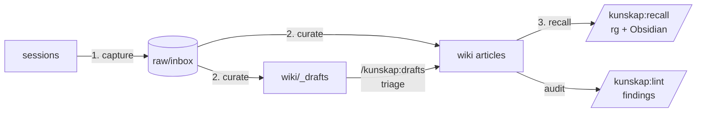

# Kunskap

[](https://github.com/Abeansits/kunskap/actions)
[](https://github.com/Abeansits/kunskap/releases)
[](LICENSE)
[](https://docs.claude.com/en/docs/claude-code/plugins)

Knowledge-base plugin for Claude Code. Sessions write loose notes into an inbox; a librarian agent compiles them into prose articles with `[[wikilinks]]` and `## Sources` provenance — Karpathy's compile model, packaged as a Claude Code plugin. Sibling to Vigil / Sigil / Ting.

## Status

**v1.0.0 — multiplayer-safe, marketplace-installable, search-enabled.** A small team can clone the marketplace, install the plugin, run `kunskap init` on a shared vault, and start using it. The phased rollout (P0 → P6) shipped on schedule; the design lives at [`docs/kunskap-design.md`](docs/kunskap-design.md).

Post-v1.0 work (cron / GitHub Actions, settings UI, search v2 with embeddings) is driven by real-usage findings, not speculative roadmaps — see the design's §Open decisions for the current deferral list.

## Install

```
/plugin marketplace add Abeansits/kunskap-marketplace
/plugin install kunskap@kunskap-marketplace
```

Then per machine, configure your identity (one-time):

```
kunskap config user --name <yourslug-lowercase> --host <stable-host-name>
```

`--name` is lowercase because the role-assignment key is case-sensitive (so `Foo`/`foo` would silently miss the role check); `--host` should be set explicitly (don't rely on `hostname -s` — machine renames silently break role checks; see Risk #5).

Verify:

```
kunskap whoami
# → yourslug@stable-host-name
```

## Per-project opt-in

Kunskap fires only in projects you've opted in. Running `/kunskap:learn enable --vault <path>` writes a `.claude/kunskap.json` marker to the project; without that marker, the plugin's hooks no-op silently and the `kunskap-vault` skill doesn't auto-load. The marker carries the absolute vault path, an `enabled: true` flag, and a `confirmed_at` timestamp.

Multiple projects can point at the same vault — common when a team has one research vault and several code repos that contribute to it. The vault path is unconstrained: you choose where on disk it lives. `/kunskap:learn status` prints the resolved vault and stamp age, and warns when the confirmation is >30 days old as a privacy nudge (Risk #7).

## The three core flows



### 1. Capture — sessions write inbox notes

The `kunskap-vault` skill auto-loads in projects that opted in (`.claude/kunskap.json` marker). The launch footer reminds Claude to capture learnings + ideas to `<vault>/raw/inbox/` at task end. The `SessionEnd` hook commits and pushes (shared vaults only — solo vaults never push, per Risk #8).

To opt a project in:

```
cd ~/Projects/my-project
/kunskap:learn enable --vault ~/Projects/my-vault
```

To bootstrap a fresh vault:

```
# Solo (never pushes):
kunskap init ~/Projects/my-vault --name "My Vault"

# Shared (sets shared = true, adds origin):
kunskap init ~/Projects/team-vault --name "Team Vault" \
  --shared git@github.com:org/team-vault.git
```

### 2. Curate — compile inbox into wiki

Run on the curator's primary machine (set in `<vault>/_meta/roles.toml`):

```
/kunskap:curate <vault-path>
# or: kunskap curate --vault <vault-path>
```

The curator agent reads `<vault>/raw/inbox/`, routes each note (Lane 1 = additive extension to existing article, Lane 2 = meaning-changing draft, Lane 3 = new article, archive otherwise), atomic-commits each article, and records the run in `<vault>/_meta/last-run/curator.json`. Hand edits to `wiki/*.md` are preserved.

Drafts surface for human triage:

```
/kunskap:drafts list
/kunskap:drafts show <id>
/kunskap:drafts approve <id> [--into <article-slug>]
/kunskap:drafts reject  <id> --reason "<why>"
/kunskap:drafts defer   <id>
```

The linter audits the wiki without writing (read-only contract enforced at the CLI):

```
/kunskap:lint
# or: kunskap lint [--vault <vault-path>] [--format text|json]
```

Findings: drift across articles, stub clusters, draft staleness (≥7d), offline arrivals (≥48h), curator absence (≥2d), identity mismatches.

### 3. Recall — search from inside a session

```
/kunskap:recall <query> [--author X] [--tag Y] [--limit N] [--format text|json]
# or: kunskap recall <query> ...
```

`recall` runs `rg --type md` over `<vault>/wiki/` and `<vault>/raw/inbox/` (Stage 1, load-bearing) and reranks paths by Obsidian's relevance when the desktop app is running with the CLI enabled (Stage 2, best-effort). `--format json` returns `{hits: [{path, line, snippet, score, author?, tags?}]}` for agent consumption.

`recall` is identity-independent — works on any machine regardless of role.

## Roles (multiplayer)

The curator and linter run only on their designated machine, so a small team can use one shared vault without races. Roles are **static config**, not dynamic locks: `<vault>/_meta/roles.toml` is hand-edited, committed, and pushed; whoever pulls latest sees the new primaries. (An earlier design tried in-vault advisory locks acquired by commit-and-push — pass-2 review found a TOCTOU race that wedged the vault mid-rebase, so locks were dropped — see design §Q4.)

Solo and pre-handoff vaults work without roles configured: a freshly-init'd vault carries `primary = "TBD"` for both roles, and the CLI warns + proceeds.

Check primaries:

```
cat <vault>/_meta/roles.toml
```

Hand off (anyone on the team can do this — it's a git commit, not a server call):

```
vim <vault>/_meta/roles.toml          # change roles.<role>.primary
git -C <vault> commit -am "<role>: hand off to <name>"
git -C <vault> push
```

Override a single run (with audit trail):

```
kunskap curate --vault <vault> --force --yes
kunskap lint   --vault <vault> --force --yes
```

`--force` runs are recorded with `forced: true` in `_meta/last-run/<role>.json`.

## Risks worth surfacing

The full risk register lives in [`docs/kunskap-design.md`](docs/kunskap-design.md) §Risks. Three are operational and worth surfacing here:

**Risk #5 — Identity fragility.** The identity-string `<user>@<host>` doubles as the role-assignment key. `hostname -s` mutates on machine renames and silently breaks role checks. Pass `--host` explicitly on `kunskap config user` and don't change it. The CLI prints a stderr warning when `--host` is omitted.

**Risk #7 — Vault privacy.** A vault holds research notes. Confirm the path before `kunskap init` and `/kunskap:learn enable` (the CLI prompts; pass `--yes` only in scripts you've already verified). The marker file's `confirmed_at` field surfaces a 30d staleness warning in `/kunskap:learn status`.

**Risk #8 — Wrong-remote pushes.** This plugin repo and the marketplace repo are content-free and public. Vault repos (`<your-team>-research/`) **must be private**. Verify your vault's remote before any push; the SessionEnd hook refuses to push vaults whose `_meta/kunskap.toml` doesn't say `shared = true`.

## Roadmap

Full design: [`docs/kunskap-design.md`](docs/kunskap-design.md). v1.0 is the end of the planned phase chain (P0 → P6); post-v1.0 work is driven by real-usage findings.

| PR | Scope |
|---|---|
| **P0** | Plugin manifest, `bin/kunskap`, `config user` / `whoami`, CI. |
| **P1** | Curator agent + manual trigger + curator-contract tests. |
| **P2** | `/kunskap:learn enable\|disable\|status` + `SessionStart` / `SessionEnd` sync hooks. |
| **P3** | `kunskap init <vault-path>` + drafts surface. |
| **P4** | Linter agent + health checks. Read-only contract. |
| **P5** | Single-primary role assignment + sharded `_meta/last-run/{curator,linter}.json` + headless-agent CWD fix. |
| **P6 (this release)** | Search (`kunskap recall`) + Obsidian Bases starters + marketplace listing + README polish. |

## License

MIT — see [`LICENSE`](LICENSE).
