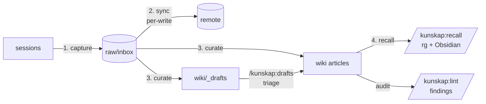

# Kunskap

[](https://github.com/Abeansits/kunskap/actions)
[](https://github.com/Abeansits/kunskap/releases)
[](LICENSE)
[](https://docs.claude.com/en/docs/claude-code/plugins)

Knowledge-base plugin for Claude Code. Agents auto-capture learnings to an inbox as they work; a librarian agent compiles them into prose articles with `[[wikilinks]]` and `## Sources` provenance — Karpathy's compile model, packaged as a Claude Code plugin. Sibling to Vigil / [Sigil](https://github.com/Abeansits/sigil) / [Ting](https://github.com/Abeansits/ting).

## Why Kunskap?

Useful findings — gotchas, design decisions, "this is how X really works" — accumulate across sessions and scatter across thread logs and scratchpads. Hard to recover; hard to share. Kunskap closes the loop:

- **Agents auto-capture.** When you `/kunskap:learn enable` a project, kunskap injects capture + recall conventions into your `CLAUDE.md`. Every session in that project sees the contract; agents drop one-paragraph notes to `<vault>/raw/inbox/` at task end.
- **Per-write async sync.** A `PostToolUse(Write|Edit)` hook commits + pushes inbox writes asynchronously — no waiting on network at session boundaries, no loss window if your laptop sleeps mid-session.
- **Librarian-compiled wiki.** A curator agent routes inbox notes into prose articles with `[[wikilinks]]` and per-source `## Sources` footers — provenance preserved; nothing silently dropped.
- **Auto-recall at task start.** The injected `CLAUDE.md` tells the agent to run `/kunskap:recall <keywords>` before diving into a non-trivial task. Prior art surfaces before plans are made, not after.
- **Multiplayer-safe.** Many writers to the inbox; one designated machine writes the wiki. No locks, no races.

## Status

**v1.2.0 — `/kunskap:setup` guided onboarding.** One slash command, one short conversation: identity + vault + project marker + (optional) multiplayer roles, all wired in ≤5 minutes. Built on v1.1's capture-and-recall foundation. The full design lives at [`docs/kunskap-design.md`](docs/kunskap-design.md).

## Install

```
/plugin marketplace add Abeansits/kunskap
/plugin install kunskap@kunskap
```

Then run guided onboarding from any project:

```
/kunskap:setup
```

`/kunskap:setup` asks three questions (identity, vault path, solo vs multiplayer), shows what it'll run, and composes the four underlying primitives in one go: `kunskap config user`, `kunskap init`, the multiplayer `_meta/roles.toml` edit, and `/kunskap:learn enable`. End state: identity written, vault initialized, project marker in `.claude/kunskap.json`, capture + recall conventions injected into `CLAUDE.md`.

For automation / CI / scripted onboarding, the underlying verb is non-interactive:

```
kunskap setup --name <slug> --host <host> --vault <path> [--init] [--multiplayer] [--yes]
```

If you'd rather wire things up by hand, all four primitives are still available standalone (`kunskap config user`, `kunskap init`, `/kunskap:learn enable`, plus a `_meta/roles.toml` edit for multiplayer). The setup verb is the composer; nothing it does is hidden from the standalone path.

`--name` is lowercase because the role-assignment key is case-sensitive (so `Foo`/`foo` would silently miss the role check); `--host` should be set explicitly (don't rely on `hostname -s` — machine renames silently break role checks; see Risk #5). Verify with `kunskap whoami` (prints `<slug>@<host>`).

## Per-project opt-in

Kunskap fires only in projects you've opted in. `/kunskap:setup` handles this for you; the underlying primitive `/kunskap:learn enable --vault <path>` does two things:

1. **Writes a marker** at `.claude/kunskap.json` carrying the absolute vault path, an `enabled: true` flag, and a `confirmed_at` timestamp. Without that marker, the plugin's hooks no-op silently.
2. **Injects a managed block into `<project>/CLAUDE.md`** (creates the file if missing) bounded by `<!-- BEGIN/END kunskap (managed) -->` markers. The block carries capture + recall conventions: filename pattern, source-priority rule, entry format, and the recall instruction at task start. Idempotent — re-enabling replaces the block in place.

`/kunskap:learn disable` cleanly removes both. The block carries a sha256 fingerprint comment so disable refuses if you've hand-edited inside the fence — no silent nuking of your edits.

Multiple projects can point at the same vault — common when a team has one research vault and several code repos that contribute to it. The vault path is unconstrained: you choose where on disk it lives. `/kunskap:learn status` prints the resolved vault, stamp age, and uncommitted-inbox count; it warns when the confirmation is >30 days old as a privacy nudge (Risk #7).

## The four core flows

Two librarian agents do the heavy lifting:

- **🤖 Curator** — reads `raw/inbox/` and writes wiki articles. Atomic per-article commits, hand-edit-preserving. Runs only on the designated curator-primary machine.
- **🤖 Linter** — audits the wiki for drift, stale drafts, missing connections, identity mismatches. Read-only — never writes.



### 1. Capture — 🤖 agents auto-write learnings; 👤 you can drop notes too

When you `/kunskap:learn enable` a project, kunskap injects capture conventions into your project's `CLAUDE.md`. Every session in that project sees the contract: drop a learning (or idea, or improvement) to `<vault>/raw/inbox/` at task end, with the documented frontmatter shape and source-priority rule. You can hand-write notes too — same path, same shape.

To opt a project in:

```
cd ~/Projects/my-project
/kunskap:learn enable --vault ~/Projects/my-vault
```

To bootstrap a fresh vault:

```
# Solo (never pushes):
kunskap init ~/Projects/my-vault --name "My Vault"

# Shared (sets shared = true, adds origin):
kunskap init ~/Projects/team-vault --name "Team Vault" \
  --shared git@github.com:org/team-vault.git
```

### 2. Sync — 🤖 hooks pull at session start, push per inbox write

`SessionStart` runs `git pull --rebase --autostash` on the shared vault before each session. `PostToolUse(Write|Edit)` commits + pushes asynchronously the moment any inbox file changes — no waiting on network at session boundaries, no loss window if your laptop sleeps mid-session.

For the rare retry case (push failed earlier; you want to flush before disconnecting), `/kunskap:sync` is the manual lever — clearer error reporting than the silent async hook.

```
/kunskap:sync
# or: kunskap sync [--vault <path>]
```

`/kunskap:learn status` shows uncommitted-inbox count, surfaces "INBOX: N uncommitted notes" when non-zero with a hint to run `/kunskap:sync`.

### 3. Curate — 🤖 curator writes the wiki; 👤 you triage drafts

Run on the curator's primary machine (set in `<vault>/_meta/roles.toml`):

```
/kunskap:curate <vault-path>
# or: kunskap curate --vault <vault-path>
```

The curator agent reads `<vault>/raw/inbox/`, routes each note (Lane 1 = additive extension to existing article, Lane 2 = meaning-changing draft, Lane 3 = new article, archive otherwise), atomic-commits each article, and records the run in `<vault>/_meta/last-run/curator.json`. Hand edits to `wiki/*.md` are preserved.

Drafts surface for human triage:

```
/kunskap:drafts list
/kunskap:drafts show <id>
/kunskap:drafts approve <id> [--into <article-slug>]
/kunskap:drafts reject  <id> --reason "<why>"
/kunskap:drafts defer   <id>
```

The linter audits the wiki without writing (read-only contract enforced at the CLI):

```
/kunskap:lint
# or: kunskap lint [--vault <vault-path>] [--format text|json]
```

Findings: drift across articles, stub clusters, draft staleness (≥7d), offline arrivals (≥48h), curator absence (≥2d), identity mismatches.

### 4. Recall — 🤖 every new task auto-recalls; 👤 you can search too

The injected `CLAUDE.md` block tells the agent: at the start of every non-trivial task, run `/kunskap:recall <keywords>` to surface prior learnings + research relevant to the goal. Prior art surfaces *before* plans are made, not after.

You can call recall directly anytime:

```
/kunskap:recall <query> [--author X] [--tag Y] [--limit N] [--format text|json]
# or: kunskap recall <query> ...
```

`recall` runs `rg --type md` over `<vault>/wiki/` and `<vault>/raw/inbox/` (Stage 1, load-bearing) and reranks paths by Obsidian's relevance when the desktop app is running with the CLI enabled (Stage 2, best-effort). `--format json` returns `{hits: [{path, line, snippet, score, author?, tags?}]}` for agent consumption.

`recall` is identity-independent — works on any machine regardless of role.

## Roles (multiplayer)

The curator and linter run only on their designated machine, so a small team can use one shared vault without races. Roles are **static config**, not dynamic locks: `<vault>/_meta/roles.toml` is hand-edited, committed, and pushed; whoever pulls latest sees the new primaries. (Lockless on purpose — see design §Q4 for the race condition that ruled out advisory locks.)

Solo and pre-handoff vaults work without roles configured: a freshly-init'd vault carries `primary = "TBD"` for both roles, and the CLI warns + proceeds.

Check primaries:

```
cat <vault>/_meta/roles.toml
```

Hand off (anyone on the team can do this — it's a git commit, not a server call):

```
vim <vault>/_meta/roles.toml          # change roles.<role>.primary
git -C <vault> commit -am "<role>: hand off to <name>"
git -C <vault> push
```

Override a single run (with audit trail):

```
kunskap curate --vault <vault> --force --yes
kunskap lint   --vault <vault> --force --yes
```

`--force` runs are recorded with `forced: true` in `_meta/last-run/<role>.json`.

## Risks worth surfacing

The full risk register lives in [`docs/kunskap-design.md`](docs/kunskap-design.md) §Risks. Three are operational and worth surfacing here:

**Risk #5 — Identity fragility.** The identity-string `<user>@<host>` doubles as the role-assignment key. `hostname -s` mutates on machine renames and silently breaks role checks. Pass `--host` explicitly on `kunskap config user` and don't change it. The CLI prints a stderr warning when `--host` is omitted.

**Risk #7 — Vault privacy.** A vault holds research notes. Confirm the path before `kunskap init` and `/kunskap:learn enable` (the CLI prompts; pass `--yes` only in scripts you've already verified). The marker file's `confirmed_at` field surfaces a 30d staleness warning in `/kunskap:learn status`.

**Risk #8 — Wrong-remote pushes.** This plugin repo and the marketplace repo are content-free and public. Vault repos (`<your-team>-research/`) **must be private**. Verify your vault's remote before any push; the sync hooks (`PostToolUse` + manual `kunskap sync`) refuse to push vaults whose `_meta/kunskap.toml` doesn't say `shared = true`.

## Roadmap

Full design: [`docs/kunskap-design.md`](docs/kunskap-design.md).

- [x] **P0** — Plugin manifest, `bin/kunskap`, `config user` / `whoami`, CI.
- [x] **P1** — Curator agent + manual trigger + curator-contract tests.
- [x] **P2** — `/kunskap:learn enable|disable|status` + `SessionStart` sync hook.
- [x] **P3** — `kunskap init <vault-path>` + drafts surface.
- [x] **P4** — Linter agent + health checks. Read-only contract.
- [x] **P5** — Single-primary role assignment + sharded `_meta/last-run/{curator,linter}.json` + headless-agent CWD fix.
- [x] **P6** — Search (`kunskap recall`) + Obsidian Bases starters + marketplace listing + README polish.
- [x] **v1.1** — Capture + recall: `CLAUDE.md` injection on `learn enable`, per-write async sync via `PostToolUse(Write|Edit)`, `/kunskap:sync` manual lever, uncommitted-inbox visibility nudges.
- [x] **v1.2** — Guided onboarding: `/kunskap:setup` slash command + `kunskap setup` CLI compose identity + vault + marker + multiplayer roles in one short conversation.

Post-v1.2 work (plan-mode hook for forced recall, `kunskap migrate` for importing existing notes, cron / GitHub Actions, settings UI, search v2 with embeddings) is driven by real-usage findings, not a fixed roadmap.

## License

MIT — see [`LICENSE`](LICENSE).
